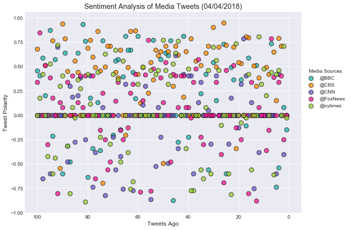
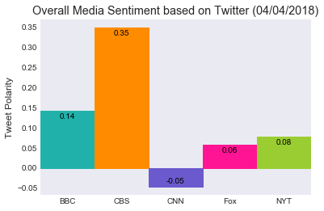

```python
# Dependencies
import tweepy
import numpy as np
import pandas as pd
import matplotlib.pyplot as plt

# Import and Initialize Sentiment Analyzer
from vaderSentiment.vaderSentiment import SentimentIntensityAnalyzer
analyzer = SentimentIntensityAnalyzer()

# Twitter API Keys
from config import (consumer_key, 
                    consumer_secret, 
                    access_token, 
                    access_token_secret)

# Setup Tweepy API Authentication
auth = tweepy.OAuthHandler(consumer_key, consumer_secret)
auth.set_access_token(access_token, access_token_secret)
api = tweepy.API(auth, parser=tweepy.parsers.JSONParser())
```


```python
target_terms = ("@BBC", "@CBS", "@CNN", "@FoxNews", "@nytimes")
# Variables for holding sentiments
sentiments = []
for target in target_terms:
    # Counter
    counter = 1
    # Variable for max_id
    oldest_tweet = None
    # Loop through 5 pages of tweets (total 100 tweets)
    for x in range(5):
        public_tweets = api.user_timeline(target, max_id = oldest_tweet)
        for tweet in public_tweets:
            results = analyzer.polarity_scores(tweet["text"])
            compound = results["compound"]
            pos = results["pos"]
            neu = results["neu"]
            neg = results["neg"]
            tweets_ago = counter
            # Get Tweet ID, subtract 1, and assign to oldest_tweet
            oldest_tweet = tweet['id'] - 1
            sentiments.append({"Tweet Account": target,
                               "Text": tweet["text"],
                               "Date": tweet["created_at"], 
                               "Compound": compound,
                               "Positive": pos,
                               "Negative": neu,
                               "Neutral": neg,
                               "Tweets Ago": counter})
            counter += 1
```


```python
# Convert sentiments to DataFrame
sentiments_pd = pd.DataFrame.from_dict(sentiments)
sentiments_pd = sentiments_pd[["Tweet Account","Text","Date",
                               "Compound","Positive","Negative","Neutral","Tweets Ago"]]
sentiments_pd
```


<div>
<style scoped>
    .dataframe tbody tr th:only-of-type {
        vertical-align: middle;
    }

    .dataframe tbody tr th {
        vertical-align: top;
    }

    .dataframe thead th {
        text-align: right;
    }
</style>
<table border="1" class="dataframe">
  <thead>
    <tr style="text-align: right;">
      <th></th>
      <th>Tweet Account</th>
      <th>Text</th>
      <th>Date</th>
      <th>Compound</th>
      <th>Positive</th>
      <th>Negative</th>
      <th>Neutral</th>
      <th>Tweets Ago</th>
    </tr>
  </thead>
  <tbody>
    <tr>
      <th>0</th>
      <td>@BBC</td>
      <td>😼 This seven-week-old jaguar is on a serious m...</td>
      <td>Wed Apr 04 07:00:06 +0000 2018</td>
      <td>-0.1511</td>
      <td>0.000</td>
      <td>0.834</td>
      <td>0.166</td>
      <td>1</td>
    </tr>
    <tr>
      <th>1</th>
      <td>@BBC</td>
      <td>Philomena Cunk's landmark mockumentary series ...</td>
      <td>Tue Apr 03 20:03:05 +0000 2018</td>
      <td>0.0772</td>
      <td>0.071</td>
      <td>0.929</td>
      <td>0.000</td>
      <td>2</td>
    </tr>
    <tr>
      <th>2</th>
      <td>@BBC</td>
      <td>🎭 Andrew Scott performs the opening lines of #...</td>
      <td>Tue Apr 03 18:03:05 +0000 2018</td>
      <td>0.0000</td>
      <td>0.000</td>
      <td>1.000</td>
      <td>0.000</td>
      <td>3</td>
    </tr>
    <tr>
      <th>3</th>
      <td>@BBC</td>
      <td>No time to shop or cook? No problem! \n🍠🥑🍅🍗🥒\n...</td>
      <td>Tue Apr 03 17:03:04 +0000 2018</td>
      <td>-0.5411</td>
      <td>0.119</td>
      <td>0.576</td>
      <td>0.304</td>
      <td>4</td>
    </tr>
    <tr>
      <th>4</th>
      <td>@BBC</td>
      <td>RT @BBCTwo: Tonight at 9pm, a cancer surgeon r...</td>
      <td>Tue Apr 03 16:22:33 +0000 2018</td>
      <td>-0.7351</td>
      <td>0.000</td>
      <td>0.735</td>
      <td>0.265</td>
      <td>5</td>
    </tr>
    <tr>
      <th>5</th>
      <td>@BBC</td>
      <td>🐊💦 Fancy a dip? https://t.co/gpfkGcue3C</td>
      <td>Tue Apr 03 16:02:04 +0000 2018</td>
      <td>0.0000</td>
      <td>0.000</td>
      <td>1.000</td>
      <td>0.000</td>
      <td>6</td>
    </tr>
    <tr>
      <th>6</th>
      <td>@BBC</td>
      <td>What's it like to live with a brain tumour? \n...</td>
      <td>Tue Apr 03 15:05:05 +0000 2018</td>
      <td>0.7351</td>
      <td>0.246</td>
      <td>0.754</td>
      <td>0.000</td>
      <td>7</td>
    </tr>
    <tr>
      <th>7</th>
      <td>@BBC</td>
      <td>RT @BBCR1: Yessssss @NiallOfficial's Live Loun...</td>
      <td>Tue Apr 03 14:50:24 +0000 2018</td>
      <td>0.0000</td>
      <td>0.000</td>
      <td>1.000</td>
      <td>0.000</td>
      <td>8</td>
    </tr>
    <tr>
      <th>8</th>
      <td>@BBC</td>
      <td>RT @BBCFOUR: Meet the woman who rocked the dar...</td>
      <td>Tue Apr 03 14:47:02 +0000 2018</td>
      <td>0.0000</td>
      <td>0.000</td>
      <td>1.000</td>
      <td>0.000</td>
      <td>9</td>
    </tr>
    <tr>
      <th>9</th>
      <td>@BBC</td>
      <td>RT @TWBBC: Koko is a gorilla who has learnt si...</td>
      <td>Tue Apr 03 14:27:34 +0000 2018</td>
      <td>0.0000</td>
      <td>0.000</td>
      <td>1.000</td>
      <td>0.000</td>
      <td>10</td>
    </tr>
    <tr>
      <th>10</th>
      <td>@BBC</td>
      <td>A Chinese family have been reunited with their...</td>
      <td>Tue Apr 03 13:15:07 +0000 2018</td>
      <td>0.0000</td>
      <td>0.000</td>
      <td>1.000</td>
      <td>0.000</td>
      <td>11</td>
    </tr>
    <tr>
      <th>11</th>
      <td>@BBC</td>
      <td>RT @bbccomedy: Philomena Cunk examines the bar...</td>
      <td>Tue Apr 03 12:57:41 +0000 2018</td>
      <td>0.0000</td>
      <td>0.000</td>
      <td>1.000</td>
      <td>0.000</td>
      <td>12</td>
    </tr>
    <tr>
      <th>12</th>
      <td>@BBC</td>
      <td>RT @BBCClick: Street Fighter II being played i...</td>
      <td>Tue Apr 03 12:41:53 +0000 2018</td>
      <td>0.5093</td>
      <td>0.170</td>
      <td>0.830</td>
      <td>0.000</td>
      <td>13</td>
    </tr>
    <tr>
      <th>13</th>
      <td>@BBC</td>
      <td>#TheSecretHelpers is on @BBCTwo tonight at 7pm...</td>
      <td>Tue Apr 03 12:05:58 +0000 2018</td>
      <td>0.0000</td>
      <td>0.000</td>
      <td>1.000</td>
      <td>0.000</td>
      <td>14</td>
    </tr>
    <tr>
      <th>14</th>
      <td>@BBC</td>
      <td>RT @BBCWales: The 2018 Commonwealth Games open...</td>
      <td>Tue Apr 03 12:02:22 +0000 2018</td>
      <td>0.0000</td>
      <td>0.000</td>
      <td>1.000</td>
      <td>0.000</td>
      <td>15</td>
    </tr>
    <tr>
      <th>15</th>
      <td>@BBC</td>
      <td>Would you let a stranger help you in a nerve-w...</td>
      <td>Tue Apr 03 12:01:00 +0000 2018</td>
      <td>0.5859</td>
      <td>0.231</td>
      <td>0.769</td>
      <td>0.000</td>
      <td>16</td>
    </tr>
    <tr>
      <th>16</th>
      <td>@BBC</td>
      <td>8-year-old Alexa is going blind, so she's crea...</td>
      <td>Tue Apr 03 11:37:31 +0000 2018</td>
      <td>-0.1082</td>
      <td>0.104</td>
      <td>0.773</td>
      <td>0.123</td>
      <td>17</td>
    </tr>
    <tr>
      <th>17</th>
      <td>@BBC</td>
      <td>RT @bbcthesocial: We're looking for folk to ma...</td>
      <td>Tue Apr 03 11:28:48 +0000 2018</td>
      <td>0.0000</td>
      <td>0.000</td>
      <td>1.000</td>
      <td>0.000</td>
      <td>18</td>
    </tr>
    <tr>
      <th>18</th>
      <td>@BBC</td>
      <td>RT @BBCScotland: A classic nursery rhyme like ...</td>
      <td>Tue Apr 03 11:22:03 +0000 2018</td>
      <td>0.3612</td>
      <td>0.116</td>
      <td>0.884</td>
      <td>0.000</td>
      <td>19</td>
    </tr>
    <tr>
      <th>19</th>
      <td>@BBC</td>
      <td>When this woman visited an uninhabited Caribbe...</td>
      <td>Tue Apr 03 11:01:05 +0000 2018</td>
      <td>0.0000</td>
      <td>0.000</td>
      <td>1.000</td>
      <td>0.000</td>
      <td>20</td>
    </tr>
    <tr>
      <th>20</th>
      <td>@BBC</td>
      <td>RT @bbcthesocial: We're flipping the script on...</td>
      <td>Tue Apr 03 10:55:48 +0000 2018</td>
      <td>0.0000</td>
      <td>0.000</td>
      <td>1.000</td>
      <td>0.000</td>
      <td>21</td>
    </tr>
    <tr>
      <th>21</th>
      <td>@BBC</td>
      <td>RT @BBCR1: "Are you ready to pump for Justin?"...</td>
      <td>Tue Apr 03 10:46:40 +0000 2018</td>
      <td>0.3612</td>
      <td>0.102</td>
      <td>0.898</td>
      <td>0.000</td>
      <td>22</td>
    </tr>
    <tr>
      <th>22</th>
      <td>@BBC</td>
      <td>RT @BBCOne: Good news klaxon! 🎉Shakespeare &amp;am...</td>
      <td>Tue Apr 03 10:31:13 +0000 2018</td>
      <td>0.4926</td>
      <td>0.138</td>
      <td>0.862</td>
      <td>0.000</td>
      <td>23</td>
    </tr>
    <tr>
      <th>23</th>
      <td>@BBC</td>
      <td>🐾🦕 New light has been shed on dinosaur evoluti...</td>
      <td>Tue Apr 03 09:29:03 +0000 2018</td>
      <td>0.0000</td>
      <td>0.000</td>
      <td>1.000</td>
      <td>0.000</td>
      <td>24</td>
    </tr>
    <tr>
      <th>24</th>
      <td>@BBC</td>
      <td>From Mary Beard not wanting to be a TV Present...</td>
      <td>Tue Apr 03 08:03:04 +0000 2018</td>
      <td>-0.5994</td>
      <td>0.000</td>
      <td>0.837</td>
      <td>0.163</td>
      <td>25</td>
    </tr>
    <tr>
      <th>25</th>
      <td>@BBC</td>
      <td>The winners of the Scottish Nature Photography...</td>
      <td>Tue Apr 03 07:16:07 +0000 2018</td>
      <td>0.7269</td>
      <td>0.337</td>
      <td>0.663</td>
      <td>0.000</td>
      <td>26</td>
    </tr>
    <tr>
      <th>26</th>
      <td>@BBC</td>
      <td>This is Maya the jaguar's very first swim! 😺💦 ...</td>
      <td>Tue Apr 03 07:03:05 +0000 2018</td>
      <td>0.0000</td>
      <td>0.000</td>
      <td>1.000</td>
      <td>0.000</td>
      <td>27</td>
    </tr>
    <tr>
      <th>27</th>
      <td>@BBC</td>
      <td>Delve into the world of @agathachristie with B...</td>
      <td>Mon Apr 02 20:02:08 +0000 2018</td>
      <td>0.0000</td>
      <td>0.000</td>
      <td>1.000</td>
      <td>0.000</td>
      <td>28</td>
    </tr>
    <tr>
      <th>28</th>
      <td>@BBC</td>
      <td>In a revealing and emotional journey, @LennyHe...</td>
      <td>Mon Apr 02 19:02:04 +0000 2018</td>
      <td>0.1531</td>
      <td>0.103</td>
      <td>0.897</td>
      <td>0.000</td>
      <td>29</td>
    </tr>
    <tr>
      <th>29</th>
      <td>@BBC</td>
      <td>A fictionalised account of how Dave Allen beca...</td>
      <td>Mon Apr 02 18:45:06 +0000 2018</td>
      <td>0.5423</td>
      <td>0.163</td>
      <td>0.837</td>
      <td>0.000</td>
      <td>30</td>
    </tr>
    <tr>
      <th>...</th>
      <td>...</td>
      <td>...</td>
      <td>...</td>
      <td>...</td>
      <td>...</td>
      <td>...</td>
      <td>...</td>
      <td>...</td>
    </tr>
    <tr>
      <th>470</th>
      <td>@nytimes</td>
      <td>Infowars published a photo of a man in "commun...</td>
      <td>Tue Apr 03 18:11:38 +0000 2018</td>
      <td>-0.2960</td>
      <td>0.000</td>
      <td>0.891</td>
      <td>0.109</td>
      <td>71</td>
    </tr>
    <tr>
      <th>471</th>
      <td>@nytimes</td>
      <td>A new ruling in the Bill Cosby case means juro...</td>
      <td>Tue Apr 03 18:07:03 +0000 2018</td>
      <td>0.0000</td>
      <td>0.000</td>
      <td>1.000</td>
      <td>0.000</td>
      <td>72</td>
    </tr>
    <tr>
      <th>472</th>
      <td>@nytimes</td>
      <td>“House Hunters” provides all the thrill of a d...</td>
      <td>Tue Apr 03 18:00:21 +0000 2018</td>
      <td>0.6283</td>
      <td>0.283</td>
      <td>0.717</td>
      <td>0.000</td>
      <td>73</td>
    </tr>
    <tr>
      <th>473</th>
      <td>@nytimes</td>
      <td>Cardi B will co-host “The Tonight Show” with J...</td>
      <td>Tue Apr 03 17:50:02 +0000 2018</td>
      <td>0.0000</td>
      <td>0.000</td>
      <td>1.000</td>
      <td>0.000</td>
      <td>74</td>
    </tr>
    <tr>
      <th>474</th>
      <td>@nytimes</td>
      <td>In Opinion,\nOp-Ed contributor Rawan Yaghi wri...</td>
      <td>Tue Apr 03 17:45:07 +0000 2018</td>
      <td>-0.2263</td>
      <td>0.000</td>
      <td>0.899</td>
      <td>0.101</td>
      <td>75</td>
    </tr>
    <tr>
      <th>475</th>
      <td>@nytimes</td>
      <td>RT @ShaneGoldmacher: NEWS: @CynthiaNixon told ...</td>
      <td>Tue Apr 03 17:39:28 +0000 2018</td>
      <td>0.4404</td>
      <td>0.132</td>
      <td>0.868</td>
      <td>0.000</td>
      <td>76</td>
    </tr>
    <tr>
      <th>476</th>
      <td>@nytimes</td>
      <td>If you saw an ad or an article pop up on your ...</td>
      <td>Tue Apr 03 17:30:10 +0000 2018</td>
      <td>0.0000</td>
      <td>0.000</td>
      <td>1.000</td>
      <td>0.000</td>
      <td>77</td>
    </tr>
    <tr>
      <th>477</th>
      <td>@nytimes</td>
      <td>Breaking News: President Trump said that he pl...</td>
      <td>Tue Apr 03 17:25:40 +0000 2018</td>
      <td>0.0000</td>
      <td>0.000</td>
      <td>1.000</td>
      <td>0.000</td>
      <td>78</td>
    </tr>
    <tr>
      <th>478</th>
      <td>@nytimes</td>
      <td>The mythical nation featured in “Black Panther...</td>
      <td>Tue Apr 03 17:15:03 +0000 2018</td>
      <td>0.1154</td>
      <td>0.068</td>
      <td>0.932</td>
      <td>0.000</td>
      <td>79</td>
    </tr>
    <tr>
      <th>479</th>
      <td>@nytimes</td>
      <td>Amazon does not own The Washington Post. Presi...</td>
      <td>Tue Apr 03 17:00:25 +0000 2018</td>
      <td>0.4215</td>
      <td>0.183</td>
      <td>0.817</td>
      <td>0.000</td>
      <td>80</td>
    </tr>
    <tr>
      <th>480</th>
      <td>@nytimes</td>
      <td>A mentally ill man on suicide watch hanged him...</td>
      <td>Tue Apr 03 16:45:08 +0000 2018</td>
      <td>-0.8910</td>
      <td>0.000</td>
      <td>0.616</td>
      <td>0.384</td>
      <td>81</td>
    </tr>
    <tr>
      <th>481</th>
      <td>@nytimes</td>
      <td>Progressive groups had pushed the Fed to diver...</td>
      <td>Tue Apr 03 16:42:11 +0000 2018</td>
      <td>0.0000</td>
      <td>0.000</td>
      <td>1.000</td>
      <td>0.000</td>
      <td>82</td>
    </tr>
    <tr>
      <th>482</th>
      <td>@nytimes</td>
      <td>The New York Stock Exchange flew the Swiss fla...</td>
      <td>Tue Apr 03 16:30:04 +0000 2018</td>
      <td>0.2732</td>
      <td>0.095</td>
      <td>0.905</td>
      <td>0.000</td>
      <td>83</td>
    </tr>
    <tr>
      <th>483</th>
      <td>@nytimes</td>
      <td>"I wouldn’t trade a year of comfort at home fo...</td>
      <td>Tue Apr 03 16:15:08 +0000 2018</td>
      <td>0.3612</td>
      <td>0.137</td>
      <td>0.863</td>
      <td>0.000</td>
      <td>84</td>
    </tr>
    <tr>
      <th>484</th>
      <td>@nytimes</td>
      <td>A former corporate lawyer is the first person ...</td>
      <td>Tue Apr 03 16:06:03 +0000 2018</td>
      <td>-0.0258</td>
      <td>0.000</td>
      <td>0.950</td>
      <td>0.050</td>
      <td>85</td>
    </tr>
    <tr>
      <th>485</th>
      <td>@nytimes</td>
      <td>On today’s internet, the devil’s advocate is l...</td>
      <td>Tue Apr 03 16:00:30 +0000 2018</td>
      <td>0.0790</td>
      <td>0.132</td>
      <td>0.749</td>
      <td>0.119</td>
      <td>86</td>
    </tr>
    <tr>
      <th>486</th>
      <td>@nytimes</td>
      <td>Bill Cosby’s criminal case provides the first ...</td>
      <td>Tue Apr 03 15:45:06 +0000 2018</td>
      <td>-0.8020</td>
      <td>0.000</td>
      <td>0.660</td>
      <td>0.340</td>
      <td>87</td>
    </tr>
    <tr>
      <th>487</th>
      <td>@nytimes</td>
      <td>Hillary Clinton’s loss prompted a surge of Dem...</td>
      <td>Tue Apr 03 15:30:14 +0000 2018</td>
      <td>-0.3182</td>
      <td>0.000</td>
      <td>0.881</td>
      <td>0.119</td>
      <td>88</td>
    </tr>
    <tr>
      <th>488</th>
      <td>@nytimes</td>
      <td>“April is also National Presidential Unawarene...</td>
      <td>Tue Apr 03 15:23:24 +0000 2018</td>
      <td>0.0000</td>
      <td>0.000</td>
      <td>1.000</td>
      <td>0.000</td>
      <td>89</td>
    </tr>
    <tr>
      <th>489</th>
      <td>@nytimes</td>
      <td>Jeremy Corbyn, leader of Britain's opposition ...</td>
      <td>Tue Apr 03 15:15:04 +0000 2018</td>
      <td>0.4019</td>
      <td>0.137</td>
      <td>0.863</td>
      <td>0.000</td>
      <td>90</td>
    </tr>
    <tr>
      <th>490</th>
      <td>@nytimes</td>
      <td>“Wine is something people can relate to. It’s ...</td>
      <td>Tue Apr 03 15:07:04 +0000 2018</td>
      <td>0.2960</td>
      <td>0.115</td>
      <td>0.826</td>
      <td>0.060</td>
      <td>91</td>
    </tr>
    <tr>
      <th>491</th>
      <td>@nytimes</td>
      <td>From July 2017: Memphis said it intended to aw...</td>
      <td>Tue Apr 03 14:54:47 +0000 2018</td>
      <td>0.7184</td>
      <td>0.302</td>
      <td>0.635</td>
      <td>0.063</td>
      <td>92</td>
    </tr>
    <tr>
      <th>492</th>
      <td>@nytimes</td>
      <td>“I really had a lot of animosity. I came from ...</td>
      <td>Tue Apr 03 14:51:33 +0000 2018</td>
      <td>-0.4404</td>
      <td>0.000</td>
      <td>0.879</td>
      <td>0.121</td>
      <td>93</td>
    </tr>
    <tr>
      <th>493</th>
      <td>@nytimes</td>
      <td>“Because of Dr. King’s death, that was one of ...</td>
      <td>Tue Apr 03 14:50:55 +0000 2018</td>
      <td>-0.5994</td>
      <td>0.000</td>
      <td>0.849</td>
      <td>0.151</td>
      <td>94</td>
    </tr>
    <tr>
      <th>494</th>
      <td>@nytimes</td>
      <td>“When we heard that Dr. King was coming to Mem...</td>
      <td>Tue Apr 03 14:50:12 +0000 2018</td>
      <td>0.5256</td>
      <td>0.185</td>
      <td>0.758</td>
      <td>0.057</td>
      <td>95</td>
    </tr>
    <tr>
      <th>495</th>
      <td>@nytimes</td>
      <td>“Back then working conditions, it was unbearab...</td>
      <td>Tue Apr 03 14:49:09 +0000 2018</td>
      <td>-0.4215</td>
      <td>0.000</td>
      <td>0.865</td>
      <td>0.135</td>
      <td>96</td>
    </tr>
    <tr>
      <th>496</th>
      <td>@nytimes</td>
      <td>The Rev. Dr. Martin Luther King Jr. was assass...</td>
      <td>Tue Apr 03 14:48:22 +0000 2018</td>
      <td>0.0000</td>
      <td>0.000</td>
      <td>1.000</td>
      <td>0.000</td>
      <td>97</td>
    </tr>
    <tr>
      <th>497</th>
      <td>@nytimes</td>
      <td>EPA chief Scott Pruitt had a $50-a-day condo l...</td>
      <td>Tue Apr 03 14:41:49 +0000 2018</td>
      <td>0.4215</td>
      <td>0.157</td>
      <td>0.843</td>
      <td>0.000</td>
      <td>98</td>
    </tr>
    <tr>
      <th>498</th>
      <td>@nytimes</td>
      <td>From last week: Here are the facts behind Pres...</td>
      <td>Tue Apr 03 14:37:03 +0000 2018</td>
      <td>0.1779</td>
      <td>0.086</td>
      <td>0.914</td>
      <td>0.000</td>
      <td>99</td>
    </tr>
    <tr>
      <th>499</th>
      <td>@nytimes</td>
      <td>On College Basketball: Donte DiVincenzo Is Vil...</td>
      <td>Tue Apr 03 14:31:32 +0000 2018</td>
      <td>0.0000</td>
      <td>0.000</td>
      <td>1.000</td>
      <td>0.000</td>
      <td>100</td>
    </tr>
  </tbody>
</table>
<p>500 rows × 8 columns</p>
</div>


```python
# export sentiments dataframe to csv
sentiments_pd.to_csv("Media_Sentiments.csv")
```


```python
# create a color dataframe to reference five tweet account with five colors
color_df = pd.DataFrame({"Tweet Account":["@BBC", "@CBS", "@CNN", "@FoxNews", "@nytimes"],
                         "color": ["lightseagreen","darkorange", "slateblue", "deeppink", "yellowgreen"]    
                         })
color_df = color_df.set_index("color")
```


```python
# scatter plot of sentiments of the last 100 tweets sent out by each news organization
plt.figure(figsize=(10,7.5))
plt.style.use('seaborn-darkgrid')
for color in color_df.index.values.tolist():    
    plt.scatter(x=sentiments_pd.loc[sentiments_pd["Tweet Account"]==color_df.loc[color,"Tweet Account"],:]["Tweets Ago"], 
                y=sentiments_pd.loc[sentiments_pd["Tweet Account"]==color_df.loc[color,"Tweet Account"],:]["Compound"], 
                s=80, color=color, label=color_df.loc[color,"Tweet Account"],alpha=0.75,edgecolor="black",linewidths=1)
plt.legend(title="Media Sources",loc='lower left', bbox_to_anchor=(1, 0.5))
# decreasing Tweets Ago
plt.xlim(105, -5)  
plt.title("Sentiment Analysis of Media Tweets (04/04/2018)")
plt.xlabel("Tweets Ago")
plt.ylabel("Tweet Polarity")
plt.savefig("Scatter_Media_Sentiment.png")
plt.show()
```





```python
# bar plot visualizing the overall sentiments of the last 100 tweets from each organization
mean_grouby = sentiments_pd.groupby(["Tweet Account"])["Compound"].mean()
plt.style.use('seaborn-dark')
bar_bbc,bar_cbs,bar_cnn,bar_fox,bar_nyt = plt.bar(np.arange(0, 5), [mean_grouby["@BBC"],
                                                                    mean_grouby["@CBS"],
                                                                    mean_grouby["@CNN"],
                                                                    mean_grouby["@FoxNews"],
                                                                    mean_grouby["@nytimes"]], width=1)
# set bar color
bar_bbc.set_color("lightseagreen")
bar_cbs.set_color("darkorange")
bar_cnn.set_color("slateblue")
bar_fox.set_color("deeppink")
bar_nyt.set_color("yellowgreen")

# show overall sentiment on bar
for each_bar in [bar_bbc,bar_cbs,bar_cnn,bar_fox,bar_nyt]:
    if each_bar.get_height()< 0:
        height = each_bar.get_height()
        plt.text(each_bar.get_x() + each_bar.get_width()/2., height+0.015,
                 str('%.2f' %float(height)), ha='center', va='center',color="k")
    else:
        height = each_bar.get_height()
        plt.text(each_bar.get_x() + each_bar.get_width()/2., height-0.015,
                 str('%.2f' %float(height)), ha='center', va='center',color="k")    
plt.xlim(-0.5,4.5)
plt.xticks(np.arange(0, 5), ["BBC", "CBS", "CNN", "Fox", "NYT"])
plt.title("Overall Media Sentiment based on Twitter (04/04/2018)")
plt.ylabel("Tweet Polarity")
plt.savefig("Bar_Overall_Media_Sentiment.png")
plt.show()
```




